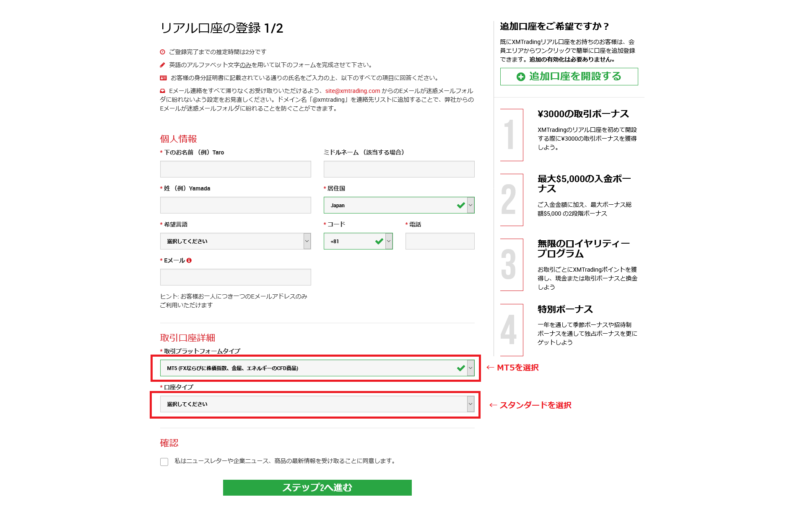
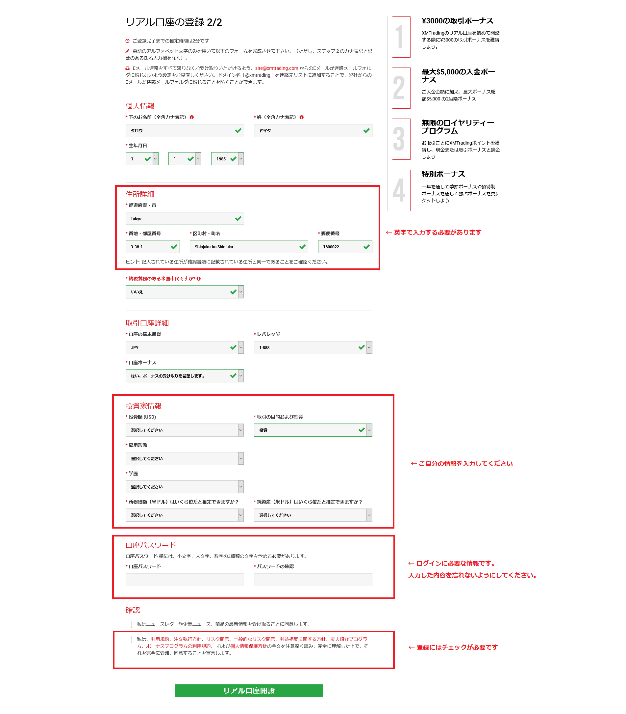
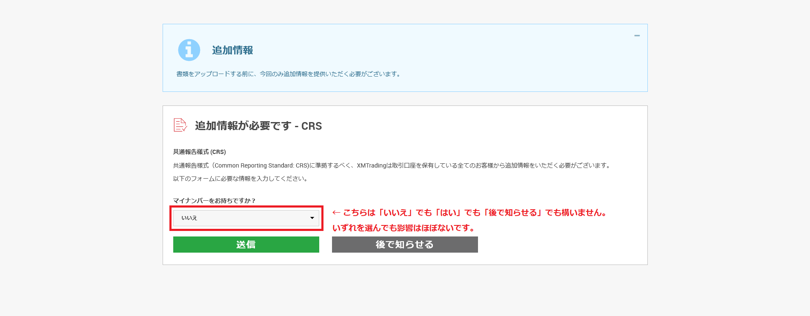
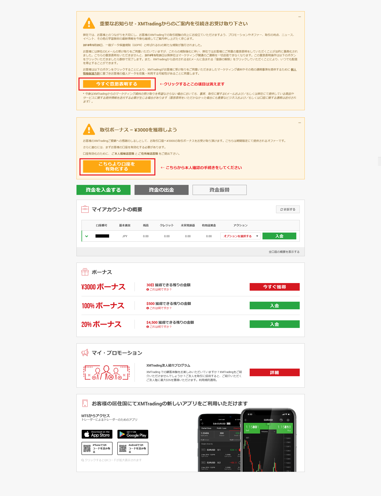
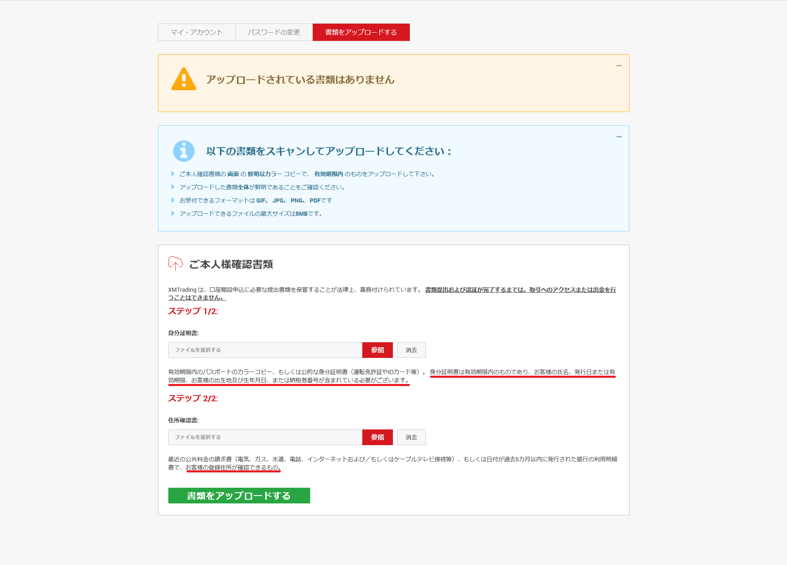

# ゼロから始めるFX

<a href="https://clicks.affstrack.com/c?m=7952&c=584822"></a>

## 自動トレードツールで売買しよう

このページでは無料でFXの売買ツール<b>MetaTrader 5</b>の自動売買を行うプログラムの<font color="blue">無料配布</font>を行っています。
当サイトのリンクから登録した方なら無料でご利用できます。
既に他のサイト経由で口座をお持ちの方は当サイト経由でリアル口座をご登録いただくとツールの利用が可能となります。

## 今回紹介するFXは以下の特徴があります
### レバレッジが888倍まで設定できる

通常国内での証券会社のレバレッジは低レバレッジが普通ですが、今回紹介する<a href="https://clicks.affstrack.com/c?c=584822&l=ja&p=0">XMTrading</a>はレバレッジの最大が888倍です。

次の項で紹介しますが多くの場合、レバレッジが高い場合<font color=red>負債</font>を追うリスクがあると言われていますがこの証券会社ではそういったデメリットは存在しません。

### 金額のゼロカットシステムがある

追証なしゼロカットシステムと呼ばれているシステムがあり、
例えば口座の残高が<font color="red">-20万円</font>などになったとしても新たな資金を入金すればリセットされ、
1万円入金すれば口座残高が-19万円ではなく、<font color="blue">1万円</font>となります。

ただし、クレジットと呼ばれるボーナス枠があり、無料でもらった金額などはこれにカウントされないので5万クレジット残っていれば-5万円でも<b>口座は表示上マイナスになっていますがプラスマイナスゼロ</b>なのでリセットされません。

### 様々なボーナスクレジットがもらえる

表題のとおりです。例えば登録すると、ボーナスがもらえるのでお試しで始めることが可能です。

詳しくはこちらをご覧ください<a href="https://xem.fxsignup.com/bonus/"> XMTradingボーナス</a>

### 様々なプラットフォームでアプリから取引状況を確認できる

<a href="https://clicks.affstrack.com/c?c=571550&l=ja&p=4">MT4 / MT5プラットフォーム</a>

## 始め方

### 1. 会員登録

#### ステップ1
<a href="https://clicks.affstrack.com/c?c=571550&l=ja&p=1">リアル取引口座を開設する</a>こちらのリンクから必要事項を入力し、「ステップ2へ進む」



#### ステップ2

必要事項を入力し、リアル口座開設を選択するとメールが来るため、ご確認ください。



#### マイナンバー入力



#### 本人確認

赤枠の口座の有効化をクリックして本人確認を開始してください。




#### 書類のアップロード

赤線の部分に注目していただきたいのですが、ステップ1とステップ2で確認されている項目が違うため、例えば免許証を両方に設定するといった事はできません。




以上までをすべて終えると審査が下り、初期ボーナスを受け取れる状態になりますので「ボーナスを獲得」をクリックして受け取りましょう。

## 自動売買環境の準備

口座の作成が終わったらいよいよ自動売買の準備に入ります。

Windows10を前提として説明していきます。

1.  <a href="https://clicks.affstrack.com/c?c=571550&l=ja&p=4">MT4 / MT5プラットフォーム</a> から MetaTrader 5をダウンロードします。

2. MetaTrader 5をインストールします。

3. MetaTrader 5を起動します。

4. 気配値表示のツールボックスを確認します。存在しない場合は上部の「メニュー」から「表示」=> 「気配値表示」をクリックします。

5. 気配値表示からUSDJPYを探します。ない場合はクリックして追加に入力してEnterを押して追加します

6. 気配値表示からUSDJPYをクリックして右のグラフエリアにドラッグします。

7. 上部の「メニュー」から「表示」=> 「ツールバー」 => 「時間足設定」を選択します。すると「M1　M5　M15」といったアルファベットと数字の表記が気配値表示の上に現れます。これを「M1」に設定します。

8. ナビゲータツールボックスを確認します。存在しない場合は上部の「メニュー」から「表示」=> 「ナビゲータ」をクリックします。

9. 口座を右クリックし、トレード口座にログインを選択します。

10. ログイン画面が出ますので、<b>口座番号</b>, <b>パスワード</b>,<b>サーバー</b>を入力します。
      口座番号、サーバーの確認方法はメールで

   ```
   お客様のMT5のID： ********. ご希望のXMTradingのMT5プラットフォームからサーバーXMTrading-MT5 3にログインしてください。
   ```

   といったように登録時に届いているはずです。
   リアル口座のサーバーは後ろに数字がついており「XMTrading-MT5(空白)3」、となっているので注意してください。

11. ログインできたら自動売買の準備は完了です。また、既に売買できる状態でもあります。

## 自動売買プログラムのインストール

1. 自動売買プログラムの <a href="https://kiyomasa-sato-0519.github.io/PhaseShift/PhaseShift.ex5">ダウンロード</a> 

2. 最新情報はこちらから確認してください。 <a href="https://kiyomasa-sato-0519.github.io/PhaseShift/README.ja.html">説明ページ</a> 

3. (1)のURLからダウンロードしたプログラムをダブルクリックします。

4. するとナビゲータの「エキスパートアドバイザ(EA)」に追加されます。

5. 上部のメニューから「ツール」=> 「オプション」=> 「エキスパートアドバイザ」を開きます。

   1. 「アルゴリズム取引を許可」にチェック
   2. 「WebRequestを許可するURLリスト」にチェックを入れ、「新しいURLを追加する」から

   ```
   https://jw0tzq2rp3.execute-api.ap-northeast-1.amazonaws.com
   ```

   上記のURLを入力する

6. OKを押してオプションを閉じる

## 自動売買の設定

相場は生き物なので常に適切な設定を指定してあげる必要があります。

そのための方法をここで解説していきます。

1. メタトレーダー5を開きます。

2. 「ストラテジーテスター」を確認します。
   見当たらない場合は上部のメニューから「表示」=> 「ストラテジーテスター」と選択して表示します。

3. 「概要」タブから「単一」を選択します。

   1. 「エキスパート」に `PhaseShift.ex5`を設定します。
   2. 「銘柄」にUSDJPYを設定します。また、銘柄の横にあるボックスにM1を設定します。
   3. 「日付」にシミュレーションしたい期間を設定します。
      1ヶ月程度で様子を見ると最近のトレンドに対応できます。
   4. 「入金」に自分が投資しようと思っている金額を入れます。また、その隣のボックスにJPYを入力します。
   5. 「オプティマイズ」に「完全アルゴリズム（遅い）」を選択します。

4. 「パラメータ」タブを表示します。

   1. `EA_Magic` 変更する必要はありません。

   2. `Lot` 1度の注文で使うロット数です。シミュレートする数値を入れます。
      初期は0.01（最小ロット)で様子を見るのがおすすめです。
      慣れてきたら口座に入金した額に合わせて大きなロット数を入力して行きましょう。

   3. `TotalLotLimit` 一つの自動売買で取り扱うLot数の制限です。なお、XMTradingでは50ロットが最大値です。

   4. `TotalPosLimit` 一つの自動売買で取り扱うポジション（注文）の制限です。

   5. 下記のパラメータにチェックを入れ、スタート値、ステップ値、ストップ値を入力します。

      1. `StopLoss` ストップロスです。この値の指定値までポイントが下がったら損失を確定します。
         例: 50(スタート, 25(ステップ), 1000(ストップ)

      2. `TakeProfit` テイクプロフィットです。この値の指定値までポイントが上がったら売上を確定します。

         例: 50, 25, 500

      3. `ResetProfit` テイクプロフィットがこの値の指定値まで下がったら利益が出る見込みのない注文としてテイクプロフィットが0円になるように調整します。

         例: 50, 25, 500

      4. `MaPeriod` Moving Average（移動平均線）指標を計算する期間

         例: 1, 1, 60

      5. `AdxPeriod` ADX (Average Directional Movement ）指標を計算する期間

         例: 1, 1, 60

      6. `TradeWait` 同じマジックナンバーで次の注文を行うまでの待ち時間(秒)
         例: 300, 300, 7200

      7. `SellAdx` 売り注文時に判断するADXの値。
         例: 1, 1, 100

      8. `BuyAdx` 買い注文時に判断するADXの値。
         例: 1, 1, 100

5. ここまで準備できたら右下のスタートを押します。

6. するとシミュレーションがスタートします。

7. 「ストラテジーテスター」のタブに「オプティマイズ結果」というタブが増えていますのでこちらで結果を確認できます。
   ただし、タブを表示した瞬間と、完了したタイミングでしか表が更新されないのでこまめにタブを切り替えるなどするとリアルタイムに近い結果が確認できます。

8. 「オプティマイズ結果」で表を右クリックします。

   1. 「フィルター」を表示し

      1. ゼロ取引
      2. 損失

      のチェックを外すことで無意味な結果をフィルタリングできます。

9. 何も結果が出ない場合は「設定」タブの内容が間違っている可能性が高いです。
   「入金」の値を増やす、レバレッジを1:888にしてみるなど試してみましょう。

10. 順当な結果が出たら次はその結果を右クリックして「この設定でバックテスト」を選択します。

11. ストラテジーテスターに「グラフ」タブが追加されますので問題なければ次は「パラメータ」タブを表示します。

12. 「パラメータ」タブで右クリックして「保存」をクリックしてわかりやすいところに保存します。

13. 「ナビゲーション」からPhaseShiftを選択し、ダブルクリックする

    1. 「共有」タブから「アルゴリズム取引」を許可にチェック
    2. 「インプット」タブで「読み込み」を選択し、先程保存した設定値を読み込む。

14. 以上でメニューバーのアルゴリズム取引が緑色になっていれば自動で売買が行われます。
